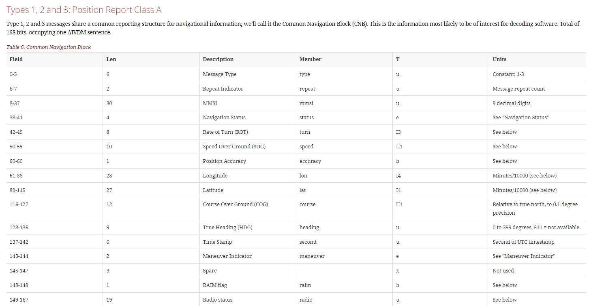
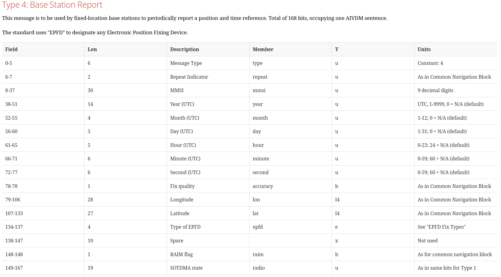

# ros_ais


**Author**: Enrico Schuetz

Software License Agreement (BSD License)

**Description**: ROS driver for the dAISy AIS (Automatic Identification System)
* CLASS A AIS POSITION REPORT (MESSAGES 1, 2, AND 3)
* AIS BASE STATION REPORT (MESSAGE 4) AND COORDINATED UNIVERSAL TIME AND DATE RESPONSE (MESSAGE 11)

## 1. Supported ROS Distribution

* ROS Noetic Ninjemys (Ubuntu 20.04)

## 2. Dependencies
* Python 3
* AIS receiver
* pyserial
* libais


## 3. Installation


pyserial must be installed if it is not on the computer.

```
$ pip install pyserial
```
install libais for `import ais`
```
cd utils/libais
python3 setup.py build
python3 setup.py install
```
create ros package
```
mkdir -p ~/catkin_ws/src
cd ~/catkin_ws/src
git clone https://git.tu-berlin.de/ecschuetz/ros_ais.git
cd ..
catkin_make
source devel/setup.bash
```

## 4. launch ais

edit launch file `launch/ais.launch` for correct serial port and baudrate
```
roslaunch ros_ais ros_daisy.py
```
alternatively change it from commandline
```
roslaunch ros_ais ros_daisy.py serial_port:=/dev/ttyACM0 baudrate:=38400  # default
```

## 5. mentioned reports 
in `msg/ros_AIS123.msg` your can find the class A AIS Position Report Messages, as defined in libais.
You can see all available Messages in the picture. For more information, see [https://gpsd.gitlab.io/gpsd/AIVDM.html](https://gpsd.gitlab.io/gpsd/AIVDM.html) and [https://github.com/schwehr/libais/blob/master/src/libais/ais1_2_3.cpp](https://github.com/schwehr/libais/blob/master/src/libais/ais1_2_3.cpp)


in `msg/ros_AIS4_11.msg` you can find the class A AIS Base Station Report, see.



